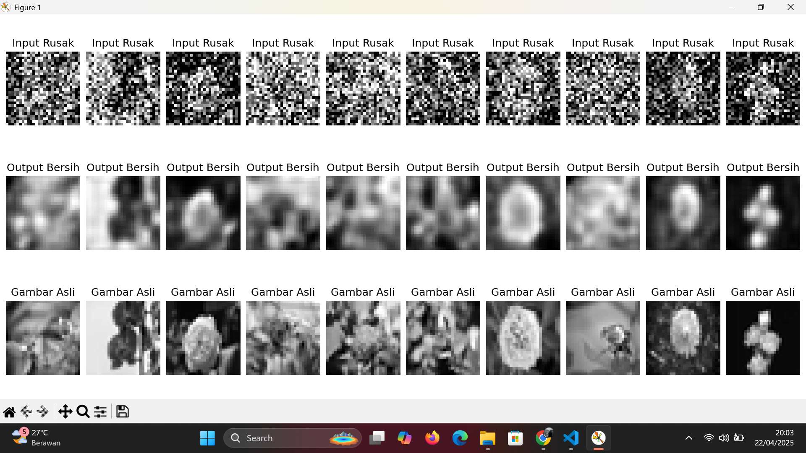

# 🧠 Autoencoder untuk Denoising Gambar `.avif`

Proyek ini adalah eksperimen sederhana untuk membersihkan gambar `.avif` yang terkena noise menggunakan **Autoencoder** berbasis CNN. Cocok buat kamu yang lagi belajar deep learning, terutama dalam pengolahan citra dan rekonstruksi gambar.

---

## 🗂 Dataset yang Digunakan

- Format gambar: `.avif` (AV1 Image File Format)
- Lokasi dataset: `e:/SEMESTER 6/Deep Learning/autoencoder11/bunga`
- Semua gambar:
  - Dikonversi ke grayscale (abu-abu)
  - Di-resize menjadi 28x28 piksel
  - Di-normalisasi ke range 0-1

Kode untuk load dan preproses gambar `.avif`:

```python
def load_avif_images(folder_path, img_size=(28, 28)):
    from pillow_avif import AvifImagePlugin
    images = []
    for filename in os.listdir(folder_path):
        if filename.lower().endswith('.avif'):
            img_path = os.path.join(folder_path, filename)
            img = Image.open(img_path).convert("L")
            img = img.resize(img_size)
            img_array = np.array(img).astype("float32") / 255.0
            images.append(img_array)
    return np.expand_dims(np.array(images), axis=-1)
```

---

## 🥪 Penambahan Noise (Data Augmentation)

Untuk membuat model belajar membersihkan noise, semua gambar yang bersih diberikan noise acak (Gaussian noise):

```python
def add_noise(images, noise_factor=0.4):
    noisy = images + noise_factor * np.random.normal(loc=0.0, scale=1.0, size=images.shape)
    return np.clip(noisy, 0., 1.)
```

---

## 🔧 Arsitektur Autoencoder

Model autoencoder dibangun dengan CNN sederhana yang terdiri dari dua bagian: **Encoder** dan **Decoder**.

### 🛅 Encoder

```python
x = layers.Conv2D(32, (3, 3), activation='relu', padding='same')(input_img)
x = layers.MaxPooling2D((2, 2), padding='same')(x)
x = layers.Conv2D(64, (3, 3), activation='relu', padding='same')(x)
encoded = layers.MaxPooling2D((2, 2), padding='same')(x)
```

### 🛄 Decoder

```python
x = layers.Conv2D(64, (3, 3), activation='relu', padding='same')(encoded)
x = layers.UpSampling2D((2, 2))(x)
x = layers.Conv2D(32, (3, 3), activation='relu', padding='same')(x)
x = layers.UpSampling2D((2, 2))(x)
decoded = layers.Conv2D(1, (3, 3), activation='sigmoid', padding='same')(x)
```

### 💾 Kompilasi Model

```python
autoencoder = models.Model(input_img, decoded)
autoencoder.compile(optimizer='adam', loss='binary_crossentropy')
```

---

## 🏋️‍♂️ Training Model

```python
autoencoder.fit(images_noisy, images_clean,
                epochs=100,
                batch_size=4,
                shuffle=True)
```

- **Epochs**: 100
- **Batch size**: 4
- **Loss**: Binary Crossentropy
- **Optimizer**: Adam

Model dilatih untuk memetakan gambar dengan noise → menjadi gambar bersih.

---

## 📉 Performa Model

Model dievaluasi berdasarkan loss function `binary_crossentropy`. Ini cocok karena kita pakai gambar grayscale dengan nilai piksel antara 0 dan 1. Loss akan turun seiring model makin pintar memperbaiki gambar rusak.

> Belum dibuat grafik loss-nya. Tapi kamu bisa tambahin callback `History` untuk mencatat dan plot-nya nanti.

---

## 🖼️ Visualisasi Hasil

Model diuji dengan cara membandingkan:

1. **Input Rusak** → Gambar yang sudah ditambah noise
2. **Output Autoencoder** → Gambar yang dibersihkan oleh model
3. **Gambar Asli** → Ground truth / target sebenarnya



```python
n = min(10, len(images_clean))
plt.figure(figsize=(20, 6))
for i in range(n):
    # Input rusak
    ax = plt.subplot(3, n, i + 1)
    plt.imshow(images_noisy[i].reshape(28, 28), cmap='gray')
    ax.set_title("Input Rusak")
    ax.axis('off')

    # Output hasil autoencoder
    ax = plt.subplot(3, n, i + 1 + n)
    plt.imshow(decoded_imgs[i].reshape(28, 28), cmap='gray')
    ax.set_title("Output Bersih")
    ax.axis('off')

    # Gambar asli
    ax = plt.subplot(3, n, i + 1 + n*2)
    plt.imshow(images_clean[i].reshape(28, 28), cmap='gray')
    ax.set_title("Gambar Asli")
    ax.axis('off')
plt.tight_layout()
plt.show()
```

---

## 📦 Library yang Digunakan

```bash
pip install numpy pillow matplotlib tensorflow pillow-avif-plugin
```

- `tensorflow` & `keras` → untuk deep learning
- `numpy` → untuk manipulasi array
- `Pillow` + `pillow-avif-plugin` → untuk membuka file `.avif`
- `matplotlib` → untuk menampilkan gambar

---

## ⚠️ Catatan Tambahan

- Pastikan kamu sudah install plugin `pillow-avif-plugin` agar Python bisa membaca file `.avif`.
- Semua gambar dikonversi ke grayscale (1 channel), jadi cocok untuk latihan autoencoder ringan.
- File `.avif` cenderung ringan tapi tetap butuh plugin khusus untuk dibaca.


